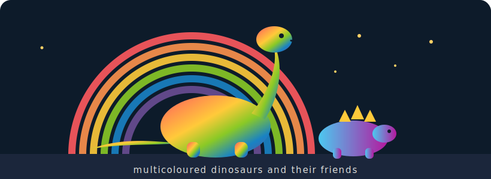

<p align="center">
  
</p>

<h1 align="center">therainbow 🦕🌈</h1>
<p align="center"><em>Multicoloured dinosaurs and their friends.</em><br>
A first-principles implementation of diffusion models — built to <b>understand</b>, not just to run.</p>

---

## What this is

Diffusion models are usually met as a black box: `pipe("a dinosaur")` → image. **therainbow
takes them apart and rebuilds them from the maths up** — forward noising, the reverse
denoising process, score/ε-prediction, samplers, and a UNet/transformer denoiser — in clear
Python, then reimplements the hot loops in **Rust** for speed.

The goal is the understanding you only get from building it: *why* the noise schedule looks
like that, *why* classifier-free guidance works, *why* a sampler trades steps for quality.

## Why Python + Rust

- **Python (numpy first, then PyTorch)** for clarity — every step readable, every tensor shape
  explained. You should be able to follow the noise from image to static and back.
- **Rust** for the parts that actually need to be fast (sampling loops, the schedule, later
  custom kernels) — via PyO3 bindings, so the learning code and the fast code live together.

## The applied counterpart

The from-scratch path here climbs toward **real, optimised diffusion**. Its production sibling
is the **LTX-2 optimisation work** (an 8 GB-VRAM inference harness over a 22B video-diffusion
model: fp8 quantisation, LoRA, structural control, web UIs). therainbow's later phases
deliberately **borrow those applied patterns** — quantisation, LoRA adaptation, VRAM-aware
sampling — once the fundamentals are solid. Learn it from scratch here; see it at scale there.

## Status & roadmap

Early. The current [`Embeddings/`](Embeddings/) and [`Image/`](Image/) folders are **reference
scripts** (Qwen embedding/image usage) — a jumping-off appendix, not the core. The core is being
built per the phased plan:

- 📍 **[ROADMAP.md](ROADMAP.md)** — the four phases (from-scratch DDPM → score/UNet → samplers → Rust).
- 🎯 **[docs/FIRST_FEATURE.md](docs/FIRST_FEATURE.md)** — the first concrete increment, specced and
  ready to build: a DDPM forward+reverse process on 2-D toy data, in pure numpy.

## Develop

```bash
pip install -e ".[dev]"
ruff check .
pytest
```

## License

MIT — see [`LICENSE`](LICENSE).
